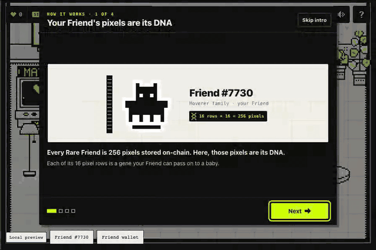

# Rare Breeds

> Your Friend's 256 on-chain pixels are its DNA.

A FriendSDK **v0.1.2** game. Your verified Rare Friend picks a mate from real Rare Friends,
an egg hatches, and the baby inherits whole pixel rows from both parents, walk cycle included.
Kept babies follow you around the nursery, earn Hearts for hats, wishes and Gene Lab locks, and can become parents
themselves (F1, F2, F3), or ride the Moon Slingshot, a Crash-style rocket. **All RF, eggs, outcomes and payouts are
simulated. Hearts are game points, never RF.** The wallet, the NFT ownership check and the character art are real.

## What only happens here

- **Heredity from on-chain pixels.** A baby is built from whole rows of its parents' 64 canonical on-chain frames, one
  row mask for all 64, so it walks with a mix of both walk cycles and no inherited pixel is ever removed. Evidence:
  [`tests/genetics.test.ts`](tests/genetics.test.ts), 500 random pairs x 4 tiers, one 8-connected body in all 64 frames.
- **Genes across generations.** Kept babies breed again (F1, F2, F3), and a Mutant's horns are pixels in its own rows, so
  a descendant of any tier can inherit them. Evidence: the same file, 231 of 430 shapes passed on (the test holds it between 42 and 58%).
- **Gene Lab: RF buys the roll, Hearts buy the genes.** Locks narrow the 630 row masks to those that agree, ranked as
  before; the tier and its odds never change. Evidence: [`tests/genelab.test.ts`](tests/genelab.test.ts), 70 golden
  samples x 4 tiers byte-identical without locks, 1,428 locked rows of 267 babies from the chosen parent in all 64 frames.
  Its daily goal is the [Dream child](#dream-child-hearts-never-rf): 16 locked rows hatch your Friend's dream exactly
  ([`tests/dream.test.ts`](tests/dream.test.ts), 292 dreams in every tier).
- **Pixel provenance.** Every row of every baby traces, through any number of generations, to the token ID of the real
  Friend whose on-chain row it is. Evidence: [`tests/legacy.test.ts`](tests/legacy.test.ts), `rowPath` and
  `rowSources` against an independent oracle, F1 to F3, cycles and 400-generation chains.
- **An open, reproducible genome.** The same inputs (Friend ID, parent keys, play ID, tier, locks) always rebuild the
  same baby in pure TypeScript with no SDK runtime import. Evidence: [`docs/GENOME.md`](docs/GENOME.md) with a runnable
  recipe; 101 of 101 unit tests pass.

| Prize category | Evidence |
| --- | --- |
| Character Spotlight | Your verified Friend's 64 on-chain frames are the genome; 73 real mates; 8 hats anchored per frame, tested on 73 pool Friends and 32 bred babies ([Pixel genetics](#pixel-genetics), [Pixel provenance](#pixel-provenance)) |
| Economy Potential | 1 RF Egg on the SDK's unchanged `ChanceGame`, 0.8875 RF expected value exact ([Rules and rewards](#rules-and-rewards-rf-simulated)); Hearts never redeemable; row royalties and a breeding market designed, not built ([Economy Potential](docs/SUBMISSION.md#economy-potential)) |



## How to play

1. **Intro.** A six-step tour opens at the start of every session: what the game is (your Friend's pixels are its
   DNA), your nursery (a picture of the real room with the four stations numbered), find a match and hatch, what can
   hatch (with the odds), what to do with a baby (Keep, Sanctuary, Moon Slingshot) and your screen (every HUD chip,
   the goal and the first tap). **Skip intro** closes it; **?** then **Replay intro** opens it again.
2. **Matchmaker** (left station, or **Find a match**). Parent A is your Friend or one of your babies. Parent B
   is one of three real wild Friends, or another baby from your brood. **New faces** rerolls the wild Friends
   for free; **Wish** (15 Hearts) offers three from a family you pick. A strip above the button shows what can
   hatch. When a chosen parent carries a shape mutation, the footer says so: "Can pass on: Horns from Zibu (about 1
   in 2)". A first visit shows one line of help (Parent A is yours, Parent B the mate) until the first breed; on wide
   frames the tabs sit in the panel header, so Parent A and all three mates show at 960 x 640 without scrolling.
   The **Gene Lab** tab lets you pick which parent gives a row (2 Hearts a row, your first 3 free): see
   [Gene Lab](#gene-lab-hearts-never-rf).
3. **Breed.** Uses one Egg. With no egg waiting, the button reads **Buy egg & breed · 1 RF** and buys one first.
   The runtime shows its own confirmations (**Buy egg**, then **Use egg**). A wild mate walks in first, then the
   egg wobbles, cracks, both parents' rows fly in and merge, and the baby is revealed.
4. **Result card.** Name, tier, hatch number and generation ("Hatch #7 · F2"), its breed ("Ghost Bones" for Skeleton
   × Hollow), any lineage titles (tap one for its meaning), parents, a DNA strip (16 rows, coloured by parent, with row
   counts), traits (inherited ones name their source: "Horns (from Zibu)"), the news: an inherited shape first
   ("Inherited: Horns from Zibu!", its rows marked violet in the DNA strip with "Rows 2-4: Zibu's Horns" and its pixels
   tinted on the baby's portrait), then what it adds to your collection ("New breed: Ghost Bones · 4/45"). Tap a DNA
   row to trace it to the real Friend it came from, however many generations up ([Pixel provenance](#pixel-provenance)).
   Both choices sit side by side: **Keep** (+5 Hearts now, then Hearts every 10 s) or **Trade in at the Sanctuary** for its
   fixed Simulated RF value (runtime confirmation **Redeem reward**). Baby names are never reused within a session.
5. **Spend Hearts.** The heart counter (top left) opens the **Hearts shop**: hats for your Friend and your babies,
   and the Wish match.
6. **Breed again.** Any kept baby can be parent A or B. A baby's generation is one more than its older parent.
   Its shape mutations pass on about 1 in 2 each, whatever the new egg's tier (the first kept baby with one says so:
   "Zibu can pass on its Horns (about 1 in 2): pick it as a parent"), and lines earn titles (Echo, Purebred, Chimera). The goal: babies from all 9 Friend families and all 4 tiers; on the side, the breed book
   of 45 named family pairs.
7. **Dream child.** After your first hatch your Friend dreams of a child: a thought bubble floats over it (tap it, or the
   bubble button top right). The Dream panel shows the child walking and the clue ("Friend #7730 dreams of a child with a
   Hoverer"). The dream mate wears a **Dream** tag in the Matchmaker; breed your Friend with it, copy the dream in the
   Gene Lab (it sits beside the preview), and every hatch of the pair reads "Dream match: 11 of 16 rows" with a peg per
   row. All 16 rows: **Dream come true!**, +50 Hearts once per dream and the **Dreamchild** title; **Dream again** dreams
   the next one. See [Dream child](#dream-child-hearts-never-rf).

The **Egg incubator** (centre station) sells 1, 3 or 5 eggs in one confirmation. The **Sanctuary** (right
station) opens your brood, where you can inspect, breed or trade in any baby.

The **Moon Slingshot** stands in front of the back-wall window, between the incubator and the Sanctuary. Walk to
it and press E (prompt **Load the slingshot**) or tap it. Once you have a kept baby, a **Moon Slingshot: x0 to
x10** prompt (with a ! badge) also opens it; it goes away the first time the panel opens. It plays like the casino
game Crash: **hold to fly, let go to jump.** The panel lists your kept babies (a gold sparkle marks one with a
lineage title, a violet DNA mark one with a shape it can pass on, and the "gone after the launch" line names them)
and, for the one you pick, the exits ladder with exact chances and this baby's total payouts: fizzles on the pad 10%
(x0), x1.5 60%, x2 45%, x4 22.5% and the Moon (automatic jump at x10) 9%. Jump early for a likely small win, hold
for a rare big one: on average every exit pays back about 0.9x (exactly 0.9x at the round exits). The panel also says
what you risk: your balance gets the baby's value either way (the trade-in), and the flight only moves the Slingshot
net: below x1 it takes, above x1 it adds (for example pond -6 RF, Moon +54 RF for a Prismatic); after the first jump
it shows the best jump so far. **Trade in, then fly** first trades the baby in: the runtime asks you to confirm
**Redeem reward**, and its fixed Sanctuary value lands in your simulated RF balance as the stake. The slingshot tosses the baby out of the
window onto a tiny firework rocket on a raft in the pond, and the flight overlay opens: **Hold to fly**. Pressing
lights the rocket, and only then is its crash point drawn. While you hold, the multiplier climbs (x2 after about
2.7 s, x4 after 5.4 s, x10 at 9 s) with the live payout under it, and the rocket climbs past the nursery roof
(x1.5), cloud nine (x2) and the orbit (x4) towards the Moon. Let go and the baby jumps and parachutes into the hay,
paid at the multiplier it jumped at. If the rocket gives out first, it sputters and the baby plops into the pond
(x0); 10% of rockets fizzle on the pad; a rocket that reaches x10 drops the baby on the Moon by itself (simulated,
see [Moon Slingshot](#moon-slingshot-simulated-side-ledger)). **The baby is gone afterwards, even in the pond.** A
result card shows the payout, the stake, the net, where the rocket would have given out ("Your rocket would have
given out at x3.41"), the record to chase ("New record: x3.12!" or "Best so far: x5.23") and where the money went:
the trade-in is in your balance, and the difference (payout minus stake, negative below x1) goes to its own HUD counter, **Slingshot net** (a moon pill reading "Slingshot +54 RF",
"Net" on phones, where it sits in the bottom band beside **Find a match**, with a Sim tag, shown from the first landing;
tapping it reopens the slingshot), never to the RF
balance. Cancelling the confirmation changes nothing. **Don't fly** (before lighting the rocket) leaves it a plain
Sanctuary trade-in: nothing is booked in the Slingshot net.

## Controls

| Action | Keyboard | Touch or mouse |
| --- | --- | --- |
| Walk | WASD or arrow keys | Tap or click the floor; drag to steer |
| Use a station | E, Enter or Space when its prompt shows | Tap the prompt, or tap the station (your Friend walks there and opens it) |
| Hop (Friend and brood) | Space or E away from a station | Tap your Friend |
| Open a baby | Brood button (bottom centre or HUD counter) | Tap the baby in the world |
| Hearts shop | Heart counter in the HUD | Tap the heart counter |
| Intro | Left / Right arrows step, Escape skips | Next, Back, Skip intro |
| Panels | Tab / Shift+Tab, Enter or Space, Escape closes | Tap; tap outside to close |
| Gene Lab (Matchmaker tab) | Up / Down pick a row, Left locks it to Parent A, Right to Parent B, Space or Delete frees it | **Top rows** / **Bottom rows** lock 3 rows of one parent; press a row on a parent's portrait, slide to adjust, release to lock it; again to free it. Shape shortcuts lock a whole shape |
| Hatch animation | Escape or **Skip**; on the result card Escape means **Keep** | **Skip** |
| Dream child | Bubble button (top right, from the first hatch on) | Tap the thought bubble over your Friend, or the bubble button |
| Trace a DNA row | Tab to the DNA strip, Up / Down move over the rows, Enter or Space traces the baby's row (again: stops), Escape stops first | Tap or click a row (again: stops); hover previews on desktop |
| Moon Slingshot: launch | **Trade in, then fly** (Enter or Space), then confirm **Redeem reward** | Tap **Trade in & fly**, then confirm **Redeem reward** |
| Slingshot flight | Hold Space or Enter on **Hold to fly**, release to jump; Escape or **Skip** also jump (and then skip to the result); Escape before lighting = **Don't fly** | Press and hold **Hold to fly**, let go to jump; **Skip** jumps |
| Sound, help | HUD buttons, top right | HUD buttons, top right |

The bottom-left and bottom-right corners stay free for the SDK runtime's wallet/Friend control and menu.
The world pauses while a panel, the intro, the hatch, the slingshot flight or a runtime confirmation is open,
and whenever the runtime sets `paused`.

## Features

### Pixel genetics

A Friend is 64 one-bit 16 x 16 frames (idle and walk, four facings, eight frames each). A baby takes each of its
16 rows from parent A or parent B, in alternating runs of 2 to 5 rows, so each parent gives at least 4 rows. The
same row mask is used for all 64 frames, so the baby's walk cycle is a real mix of both parents' walk cycles.
Up to 64 seeded masks are scored and the best valid one wins. Each frame is then repaired into one 8-connected
body with the fewest added pixels; no inherited pixel is ever removed. Symmetric parents give symmetric front
and back views. The tier adds its pattern and mutation on top. **Side-walker** is dominant: Colossus Friends have
no front or back art, so any baby with a Colossus (or Side-walker) parent shows its right-facing frames from
every side, through every generation. Everything is deterministic from `(your Friend ID, parent A, parent B,
play ID)` and takes a few milliseconds per baby (test budget: under 5 ms on average). See
[`src/genetics.ts`](src/genetics.ts) and [`docs/media/genetics-sheet.png`](docs/media/genetics-sheet.png).

**The ledger decides the rarity, you decide the genes.** New shape mutations (antennae, horns, ears, crest, a tail and
their bold variants) still grow only on Mutant and Prismatic hatches. But a shape lives in its parent's own pixel rows,
so a baby that takes all of those rows carries it, in any tier, Common included, and passes it on again (grandparent,
parent, baby). A shape bobs and walks with the body, so its rows are the rows it covers in any of the 16 frames (idle
and walk) of every facing it grew on, and a baby counts as carrying it only when it is whole in every one of those
frames. The mask ranking adds one seeded wish per parent trait (take it or leave it, 1 in 2) after the hard checks (ink
floor, connectivity, symmetry, coherent walk cycle) and before the score, so the measured pass-on rate is **53.7%**
(231 of 430 passable traits in [`tests/genetics.test.ts`](tests/genetics.test.ts); 47 to 58% per tier; 48.7% one
generation later, 127 of 261), shown as "about 1 in 2" (the test keeps it between 42 and 58%). Detection is a pure check of real
pixels: every row of the trait came from that parent and every trait cell is ink in the baby's own frame, frame by
frame (`inheritedShapes`; `Dna.shapes` records each shape with its cells in every frame and its source).
A Mutant or Prismatic that already carries a head mutation grows a tail instead of a second head (or nothing new
when no tail fits or it carries one). A patterned parent's kind (spots, stripes, patch) is tried first when the
baby's tier shows a pattern. Babies of two Friends are unchanged, pixel for pixel. See
[`docs/media/genetics-inherit.png`](docs/media/genetics-inherit.png).

### Gene Lab (Hearts, never RF)

**The ledger rolls the rarity, you design the genes: RF buys the roll, Hearts buy the genes.** The Matchmaker's
**Gene Lab** tab opens with what it is for ("Pick which parent gives the eyes, ears or feet: lock their rows.") and
shows Parent A, a rail of 16 row locks, a preview of the baby (locked rows solid from their parent, free rows both
parents faint; Parent A's paper band gets an ink rule above and below), a second rail and Parent B. Tap a row on a
parent to lock it to that parent, tap it again to free it. Four shortcuts work on every pair: **Top rows** and **Bottom
rows** from each parent lock 3 rows (the session's free rows) from the pair's first inked row down or up from its last
(`edgeLocks`). Each shape the pair can pass on gets a shortcut too ("Lock Horns from Zibu") that locks all of its rows;
the footer then reads "Will pass on: Horns from Zibu" instead of "about 1 in 2". A shortcut the locks rule out is
disabled. The tier still comes from the ledger alone.

- **Genetics** (`breed({ locks })` and `lockOptions` in [`src/genetics.ts`](src/genetics.ts)): the candidate masks are
  the 630 masks of `ALL_MASKS` (runs of 2 to 5 rows, each parent at least 4 rows) that agree with the locks, with the
  same seeded choice and ranking (hard checks, inheritance wishes, score); the finalists scale with the smaller pool, so
  the same locks still hatch different babies. The counter reads "24 of 630 possible babies": masks that agree, pass the
  hard checks and build. Without locks the median pool pair has 624 (425 at the 5th percentile); 14 of 5,256 near-twin
  pairs have none, and the lab says so. A toggle that would leave no possible baby is disabled.
- **Proven** in [`tests/genelab.test.ts`](tests/genelab.test.ts): without locks every baby is byte-identical to before
  (golden digests of 70 samples in all 4 tiers: pool pairs, Colossus pairs, F2 babies of shaped parents); in 267 babies
  with random allowed lock sets (pool and baby parents, every tier) all 1,428 locked rows come from the chosen parent in
  all 64 frames, and each baby is one of the counted ones; a toggle is disabled exactly when it leaves none; 90 shape
  shortcuts (360 babies, all 4 tiers) all carry the locked shape; all 320 edge shortcuts of 80 pairs are enabled exactly
  when a baby is left, and their babies take every locked row. `node dev/ui/lab-check.mjs` presses the first and last
  pixel of every row on both rails and all three portraits (960 x 640, 390 x 651, 360 x 480): each names its own row.
- **Cost of a toggle:** the first look at a pair assesses its 630 masks once (about 40 ms in Node on a laptop, more on
  slow phones). It never runs inside a render: the Parents tab assesses the chosen pair while the browser is idle, and
  a lab opened before that runs it right after its first paint (`useLockOptions`), counting "... of 630" and toggling
  nothing until then. After that a toggle takes about 0.2 ms in `lockOptions` and about 5 ms in the browser, render and
  portraits included.
- **Determinism:** the baby records its locks (`Dna.locks`). A laid egg keeps its pair and locks, so **Finish hatching**
  hatches exactly what was chosen and paid for (shown read-only: "5 locks, 4 Hearts paid", or "3 locks, free"). If the
  Hearts are gone when the egg is used, it hatches without locks, never with free ones. Locks stay while the same pair is picked, also after a
  cancelled confirmation, and clear after a hatch. The result card marks locked rows with a small lock in the DNA strip
  ("Locked rows 1-4, 14-16") and the news says "Locked 5 rows, all inherited".
- **Touch:** the 16 rows are 3 to 7 CSS px tall (4 or 5 on phones), far below the 44 px target. So on phones the main
  path is the 44 px shortcuts (**Top rows**, **Bottom rows**, shapes) and **Free all rows**, plus the press on a
  portrait (a band and the caption name the row under the finger; slide, then release); the rails suit a mouse and the
  keyboard. On short landscape frames (under 300 px tall) the lab scrolls, so a finger that travels over a portrait
  scrolls it instead of locking a row.

### Dream child (Hearts, never RF)

**Every day your Friend dreams of a child. Find the mate and the rows to make it real.** It gives the Gene Lab a goal and
keeps your Friend the protagonist. Pure logic in [`src/dream.ts`](src/dream.ts); panel in `src/ui/DreamPanel.tsx`; the
bubble in `src/scene/bubble.ts`.

- **The dream:** from (your local date, your Friend's ID, the round) a seeded mate from the 73 wild Friends (never your
  Friend; one that differs from it in at least 8 rows) and a row mask among the best-scoring quarter of the pair's
  possible masks (`possibleMasks` in `src/genetics.ts`: hard checks pass, it builds). The dream child is that body, no
  pattern or mutation. Locking all 16 rows to the mask hatches it exactly, in any tier.
- **Clue and feedback, like Mastermind:** the picture (the child walking) and the mate's family. The dream mate gets a
  **Dream** tag among the wild mates, and with your Friend as Parent A and it as Parent B the Gene Lab shows the dream
  beside the preview (on phones under it, next to the Top / Bottom rows shortcuts, so the lab still fits). After each
  hatch of that pair the card reads "Dream match: 11 of 16 rows", a peg per row on the baby (filled where it matches)
  and a traced row says "like the dream". A row matches when it came from the same parent as in the dream, or when both
  parents draw it alike in all 64 frames (it looks the same either way). No row feedback before the egg is paid.
- **Solving:** 16 of 16 rows is **Dream come true!**: +50 Hearts once per dream, the cosmetic **Dreamchild** title
  (stacks with the others) and a short burst over the card (none with reduced motion). **Dream again** dreams the next
  round; its reward is new.
- **Solvability, measured** in [`tests/dream.test.ts`](tests/dream.test.ts) over 292 dreams (73 pool Friends x 4 dates):
  a fresh set of wild mates (New faces, or the new faces after every hatch) brings the dream mate 27.6% of the time
  (a 1 in 4 dream bonus on top of the plain 3 in 72), 3.56 sets on average, 81.1% within 5; a Wish for its family
  (15 Hearts) always does. The first try matches 9.6 of 16 rows on average, and its pegs name the whole dream: locking
  every row that tells the parents apart makes it real on the second egg (21.8 Hearts on average, using the 3 free
  locks); locking only the misses takes 3.53 eggs (median 3, at most 6) and 38.7 Hearts. With the first hatch that wakes
  the dream, a first-time player needs about 3 to 4 eggs and 20 to 40 Hearts.
- **Economy:** every attempt is an ordinary 1 RF simulated egg; the tier and its odds never change (`game.json`
  untouched, `node tools/economy-report.mjs` byte-identical). The dream pays Hearts (game points, never RF).

### Hearts (game points, never RF)

Hearts give **Keep** a reason next to the Sanctuary's fixed RF value. They live only in this session
([`src/hearts.ts`](src/hearts.ts)).

| Rule | Value |
| --- | --- |
| Income per kept baby, every 10 s | Common 1, Spotted 2, Mutant 4, Prismatic 10 Hearts (6, 12, 24, 60 per minute) |
| Average kept baby | 0.6 x 6 + 0.25 x 12 + 0.125 x 24 + 0.025 x 60 = 11.1 Hearts per minute |
| Keep bonus | +5 Hearts each time you keep a baby |
| Income pauses | While the runtime is paused (menus, confirmations), during the intro and a hatch, and while the tab is hidden |
| Dream child | +50 Hearts the first time a dream comes true (all 16 rows); **Dream again** starts a new dream with its own reward |
| Gene Lab | 2 Hearts per locked row; the first 3 locked rows of a session are free, so a first hatch with 0 Hearts can lock 3. Charged only once the egg is used (**Use egg** confirmed): a cancelled confirmation costs nothing, **Finish hatching** is already paid. The Hearts shop names it too |
| What Hearts are not | Not RF. They cannot be bought with RF, traded in or redeemed, so they back no payout and need no prize reserve |

Example, one baby on its own: a Common trades in for 0.5 RF, or earns 6 Hearts a minute and, with the Keep bonus,
pays for a Party hat in 2.5 minutes. A Prismatic trades in for 6 RF, or earns 60 Hearts a minute and pays for the
Halo in about 4 minutes. Locking a 4-row shape once the free rows are used costs 8 Hearts, about 45 s of one average
kept baby.

### Hearts shop: hats and Wish match

| Item | Hearts |
| --- | ---: |
| Party hat | 20 |
| Bow | 20 |
| Flower | 25 |
| Beanie | 35 |
| Headphones | 50 |
| Top hat | 80 |
| Crown | 150 |
| Halo | 250 |
| **Wish match**: the Matchmaker offers three wild Friends from a family you pick (the dream mate's family always brings the dream mate) | 15 |

The full wardrobe costs 630 Hearts. Each hat is bought once and worn by one creature at a time (your Friend or any
baby); putting it on someone else moves it, and a traded-in baby's hat returns to the wardrobe. A hat is drawn on
**each frame's own head**, so it bobs and walks with the canonical art in all four facings, and it **never covers
a pixel of body ink** ([`src/accessories.ts`](src/accessories.ts), [`docs/media/accessories-sheet.png`](docs/media/accessories-sheet.png)).

### Collection goal

Breed babies from all **9 Friend families** and find all **4 tiers**. A family counts once any hatched baby
(kept or traded in) has it as a parent family; a tier counts once any egg hatches it. The reveal card names new
finds ("New family: Hollow · 3/9"), the brood shows the set, and the Wish match marks families you still need.
No reward is attached; it is a goal.

### Breed book, lineage titles and hatch numbers (cosmetic)

- **Breed book** ([`src/breeds.ts`](src/breeds.ts)): each of the 45 unordered family pairs (9 purebreds, 36 crosses) has
  a name, from Skeleton × Hollow "Ghost Bones" and Colossus × Hoverer "Blimp" to Cellular × Cellular "Cell Division". A
  baby's breed comes from the two families in its label. The card shows it beside the family, a first find reads "New
  breed: Ghost Bones · 4/45", and the brood's collection box counts "Breeds 4/45" with a breed book in family order
  (found names over their pair; the rest show the pair to try, dimmed, "Skeleton × Mask ???").
- **Lineage titles** ([`src/titles.ts`](src/titles.ts)), traced row by row to the real Friends they came from
  ([`src/legacy.ts`](src/legacy.ts)): **Echo of #id** (at least 12 of 16 rows from your own Friend, e.g. a
  backcross), **Purebred <Family>** (all 16 rows from one family), **Chimera** (rows from at least 4 distinct
  Friends), **Dreamchild** (all 16 rows match your Friend's dream, see [Dream child](#dream-child-hearts-never-rf)).
  Titles stack in that order and show on the card and in the brood. A first one explains itself ("First Echo:
  12 of 16 rows from your Friend, just for show"), and tapping a title badge on the card shows its meaning.
- **Hatch number:** this session's settled hatches, oldest first, with the generation: "Hatch #7 · F2".

None of these changes a tier, an odd or a value: the Sanctuary pays by tier only.

### Pixel provenance

A baby's row y is always row y of one parent, so every row of every baby, through any number of generations, is one
real on-chain Friend's row: its token ID is known. Tap a row of the baby in the DNA strip ("Tap a row to see which real
Friend it came from", on every card) and the path shows, as in a test run: "Row 8 of Loma: your Friend #7730 (Hoverer)
via Veve (F1)" ("from Parent B" for an F1), with a swatch in the colour of the side the row came in by. When that Friend is further up than a parent, its portrait appears with the row lit and outlined:
on wide cards beside the parent the row came through, its row level with theirs, on phones in the caption. From F2 on
the card also says where the 16 rows come from, your own Friend first, in the signal colour: "6 of 16 rows are your
Friend #7730", then the other real Friends, most rows first: "rest from #50115 x7 · #159358 x3" (Loma again; a baby
with no row of your Friend reads "Rows from 3 real Friends: ..."). Both come from [`src/legacy.ts`](src/legacy.ts) (`rowPath`, `rowSources`),
on the same memoised tracer as the titles, so traded-in ancestors still resolve and missing data or cycles end a path
safely. One row mask covers all 64 frames, so the row is the same in every frame; a Side-walker's rows are its
ancestors' right-facing rows, which is what its portraits show. The trace works on the reveal card and on every
baby's card in the brood; nothing here touches RF, odds or values.

### Onboarding

The six-step intro uses your own Friend and a real wild mate, with example babies bred by the same genetics
(presentation only, never kept or counted). Its nursery step paints the real room art (walls, props, the four stations
at rest and your Friend) into a canvas and pins numbered markers on the stations; its "What to do with a baby" step
shows Keep and the Sanctuary as the same Common to Prismatic range (6 to 60 Hearts a minute, 0.5 to 6 RF) and says a
kept baby passes on its mutations; its last step shows copies of the HUD chips with their live values. The **?** panel
repeats both legends ("Stations" and "Your screen") next to the rules. First-time hints: a "Start here" coach on
**Find a match**, a note in the Matchmaker about the runtime confirmations to expect, a Keep or trade-in hint and "Tap a
row to see which real Friend it came from." on the first reveal card, and a toast when the first kept baby with a shape
can pass it on. The Matchmaker's first-time help is one line (Parent A is yours, Parent B the mate), so the mates stay
in view; the Gene Lab is found by its tab's "3 FREE" badge, opens with one line on what locking is for, and the **?**
rules and the Hearts shop each name it in one sentence (2 Hearts a row, the first 3 free).

### Phone layout

[`host.css`](host.css) gives portrait screens up to 600 px wide the tallest runtime frame that fits them, in steps
from 3:4 down to 1:2 (a 390 x 664 iPhone Safari view gets 390 x 650, a 360 x 640 Android phone 360 x 640, a 390 x 844
view 390 x 780), so the nursery is not a thin strip. Where the browser supports small viewport units the frame never
outgrows the visible height with its bars shown, so the page does not scroll and the runtime's toolbar and
confirmations (inside the frame) stay on screen; landscape phones keep the 3:2 frame, narrowed to fit the height.
Frames narrower than 600 or lower than 400 CSS px zoom in with a follow camera that keeps your Friend centred between
the HUD and the action bar; on tall portrait frames the room's full height sits between them. The flight shows a
taller slice of its scene on portrait phones (the baby about 90 px tall on a 390 px phone), panned from the window
to the landmarks and the landing.

## Rules and rewards (RF, simulated)

Source of truth: [`game.json`](game.json). One Egg hatches exactly one baby. The tier (outcome) is decided by
the SDK ledger when the egg is settled. Which parents you pick never changes the odds: an inherited shape changes
the look, never the tier or its value.

| outcomeId | Outcome | Weight | Chance | Sanctuary value | Base units | EV share | Look |
| ---: | --- | ---: | ---: | ---: | ---: | ---: | --- |
| 1 | Common hatchling | 6,000 bps | 60% (3 in 5) | 0.5 RF | `500000000000000000` | 0.3 RF | Pure ink rows from both parents |
| 2 | Spotted hatchling | 2,500 bps | 25% (1 in 4) | 1 RF | `1000000000000000000` | 0.25 RF | Green spots, stripes or a patch |
| 3 | Mutant hatchling | 1,250 bps | 12.5% (1 in 8) | 1.5 RF | `1500000000000000000` | 0.1875 RF | Violet pattern plus a head mutation (antennae, horns, ears or crest; a tail if none fits) |
| 4 | Prismatic hatchling | 250 bps | 2.5% (1 in 40) | 6 RF | `6000000000000000000` | 0.15 RF | Rainbow body, a mutation (bold when it fits) and a tail |
| | **Total** | 10,000 bps | 100% | | | **0.8875 RF** | |

| Rule | Exact value |
| --- | --- |
| Egg price | 1 RF (`1000000000000000000` base units) |
| Expected Sanctuary value | (0.5 x 6000 + 1 x 2500 + 1.5 x 1250 + 6 x 250) / 10000 = 8875 / 10000 = **0.8875 RF per egg** (`887500000000000000`): 88.75% return, 11.25% house edge |
| Maximum prize | 6 RF. Every purchased or pending egg reserves 6 RF of backing |
| Kept babies | Keep their fixed RF value reserved. Redemption has no expiry |
| Preview ledger (SDK `GameHost`) | 20 RF simulated balance; 60 RF simulated stake (6 RF maximum prize x 10) |
| Purchase rule | Free stake must cover the maximum prize before and after the purchase. At the start, eggs are buyable immediately (60 RF >= 6 RF) |
| Backing pause | Free stake after n hatches = 60 RF + sum(1 RF price - reward). Purchases pause only after 11 Prismatic hatches in a row (p = 2.38e-18). Trading a baby in does not change free stake |
| Unhatched eggs | Also reserve 6 RF each: at most 12 in one purchase, or 11 bought one at a time, from a fresh session |
| Pending hatch | A used egg that has not settled shows **Finish hatching** and settles the same play. It never uses another egg |

What 20 simulated RF buys (`node tools/economy-report.mjs`: exact math, then 5,000 sessions per strategy on the
SDK's own `createGamePreview` ledger, seed 7730):

| Strategy | Hatches (minimum) | Median | Mean |
| --- | ---: | ---: | ---: |
| Keep every baby | 20 | 20 | 20.0 |
| Trade in only Commons | 20 (21 observed) | 28 | 28.1 |
| Trade in every baby | 39 (49 observed) | 143 | 173.7 |

In 20 hatches: P(at least one Prismatic) = 1 - 0.975^20 = 39.7%; P(at least one Mutant or Prismatic) = 1 - 0.85^20 = 96.1%.

### Moon Slingshot (simulated side ledger)

Source of truth: [`src/slingshot.ts`](src/slingshot.ts); every number below is proven exactly in
[`tests/slingshot.test.ts`](tests/slingshot.test.ts) (21 tests) and printed by `node tools/economy-report.mjs`.
A launch is a Sanctuary trade-in plus a Crash-style multiplier. First the SDK redeems the baby (`redeem(outcomeId, 1)`,
runtime confirmation **Redeem reward**): its tier token is burned and its fixed Sanctuary value, the **stake**, lands
in the simulated RF balance. Then the baby rides the rocket, and the side ledger books only the difference, payout
minus stake.

- **The multiplier** while the player holds: m(t) = e^(k t) with k = ln(10) / 9 s, shown in whole hundredths
  (floor(100 x 10^(t / 9 s))): x1.00 at ignition, x1.5 after 1.59 s, x2 after 2.71 s, x4 after 5.42 s, x10 at
  exactly 9 s. Letting go jumps at the multiplier showing: exit = floor(m x 100) / 100.
- **The crash point:** one roll in 0-9999, drawn once when the player presses (ignition), never redrawn:
  C = floor(900000 / (roll + 1)) hundredths, capped at x10. A jump at h wins when C >= h and pays stake x h / 100,
  rounded down to whole base units. If the multiplier passes C first, the rocket gives out and the baby lands in the
  pond (x0). Rolls 9000-9999 (C below x1) fizzle on the pad; rolls 0-899 (C = x10) jump onto the Moon by themselves.
- **Exact odds:** P(C >= h) = floor(900000 / h) / 10000 for every h. Always jumping at h therefore pays back
  h x floor(900000 / h) / 10^6 of the stake: exactly **x0.9** whenever h divides 900000 (x1, x1.5, x2, x4, x10 and
  every exit on the ladder), never more, and at least x0.899 for any exit (lowest: x0.899052 at x9.73). **The
  timing changes the risk, not the payback.**

| Exit | Winning rolls | Chance | Reached after | Payback | Common (0.5 RF) | Spotted (1 RF) | Mutant (1.5 RF) | Prismatic (6 RF) |
| --- | --- | ---: | ---: | ---: | ---: | ---: | ---: | ---: |
| Fizzles on the pad | none (rolls 9000-9999 fizzle) | 10% | at ignition | x0 | 0 RF | 0 RF | 0 RF | 0 RF |
| Jump at x1 | 0-8999 | 90% | 0 s | x0.9 | 0.5 RF | 1 RF | 1.5 RF | 6 RF |
| Jump at x1.5 | 0-5999 | 60% | 1.59 s | x0.9 | 0.75 RF | 1.5 RF | 2.25 RF | 9 RF |
| Jump at x2 | 0-4499 | 45% | 2.71 s | x0.9 | 1 RF | 2 RF | 3 RF | 12 RF |
| Jump at x4 | 0-2249 | 22.5% | 5.42 s | x0.9 | 2 RF | 4 RF | 6 RF | 24 RF |
| Moon, automatic jump at x10 | 0-899 | 9% | 9 s | x0.9 | 5 RF | 10 RF | 15 RF | 60 RF |

Any other exit works the same way, for example a Common jumping at x2.37 wins 1.185 RF on rolls 0-3796 (37.97%).

| Rule | Exact value |
| --- | --- |
| Expected payback | At most **x0.9** of the stake for every exit from x1.00 to x10.00, exactly x0.9 at the round exits (exact over all 10000 rolls): 90% return, 10% edge (the same edge as the SDK fishing reference), which stays in the Moon Fund |
| Launch every baby | Jumping at any round exit: 0.8875 RF per egg x 0.9 = **0.79875 RF per egg** (`798750000000000000`), 79.875% of the 1 RF price. Exact over all 10^8 egg and crash roll pairs |
| Moon Fund | Simulated, **600 RF** (`600000000000000000000`) at session start: 10 x the top payout (Prismatic 6 RF x10 = 60 RF), the same x10 convention `GameHost` uses for the egg stake |
| Backing rule | A baby worth v flies only while the Moon Fund holds at least its Moon payout (10 v), whatever exit the player will pick; the panel checks this before the trade-in. The fund takes the stake and pays the payout, so it moves by the negative net: fund' = fund + v - payout >= v, and it never goes negative |
| Backing pause | The largest drain per launch is 54 RF (a Prismatic on the Moon), so the first 11 launches of a session can never be blocked. 11 Prismatic Moon landings in a row leave 6 RF; then only Commons (Moon payout 5 RF) still fly. The panel names the reason when a baby cannot fly |
| One draw, final | The crash point is drawn once, at ignition, after the trade-in is confirmed. No reroll, and every result is final: the launched baby is gone for good, even in the pond. Cancelling the confirmation changes nothing; **Don't fly** before ignition books nothing in the side ledger (a plain Sanctuary trade-in) |
| Paused or hidden | If the runtime pauses (menu, confirmation) or the tab is hidden mid-flight, the baby jumps at once at the multiplier showing |
| Slingshot net | Its own HUD counter (simulated, can be negative): the sum of payout minus stake over all launches. Never added to the runtime RF balance, so it cannot buy eggs in the preview. The stakes are ordinary Sanctuary redemptions and stay in the balance |

Sessions that launch every baby (`node tools/economy-report.mjs`: 5,000 sessions per exit strategy on the SDK's
`createGamePreview`, egg rolls seed 7730, crash rolls seed 7731, each from 20 RF: breed while the runtime sells an
egg, trade every baby in and launch it, so the trade-ins keep paying for eggs). Every strategy makes 173.7 launches
and stakes 154.236 RF on average (the same egg rolls as "Trade in every baby" above, because the net never reaches
the spendable balance); the exact identity is E[net] = -0.1 x E[staked] = -15.424 RF.

| Strategy | Paid launches | Mean net | Net p5 / median / p95 | P(net > 0) | Moon landings | Moon Fund lowest | Blocked |
| --- | ---: | ---: | ---: | ---: | ---: | ---: | ---: |
| Jump at x1.5 | 60.0% | -15.470 RF | -45.75 / -12 / +3.5 RF | 10.8% | 0 | 569.5 RF | 0 of 5,000 |
| Jump at x2 | 45.0% | -15.419 RF | -51.5 / -12.5 / +9.5 RF | 18.6% | 0 | 539.5 RF | 0 of 5,000 |
| Jump at x4 | 22.5% | -15.222 RF | -67.5 / -12.5 / +28.5 RF | 28.4% | 0 | 465.5 RF | 0 of 5,000 |
| Ride to the Moon | 9.0% | -15.202 RF | -91.5 / -15.5 / +67.5 RF | 33.3% | 15.7 per session | 322.5 RF | 0 of 5,000 |

Same payback, different risk: the later you jump, the wider the spread and the lower the Moon Fund's low point, and
the fund never blocked a launch.

## What is simulated and what is real

| Simulated (SDK preview ledger) | Game state only (this session) | Real |
| --- | --- | --- |
| RF balance, prize stake, eggs, plays, tiers, Sanctuary payouts | Hearts, hats, Gene Lab locks, the dream, the collection, the brood's lineage, titles and the breed book | Wallet connection and a fresh ownership/eligibility read by the SDK runtime (Robinhood mainnet, chain 4663) |
| Every **Buy egg**, **Use egg** and **Redeem reward** confirmation ("Simulated RF. No transaction will be sent.") | | Your Friend's 64 canonical frames, read on-chain through the SDK's `createFriendReader` |
| | | The wild mates' art: canonical frames of 73 real Friends (see Credits) |

Game code uses only the SDK's fixed action client (`read`, `buy`, `play`, `settle`, `redeem`) and moves RF only
through it; a slingshot launch's trade-in is an ordinary `redeem`. Hearts, hats and the slingshot's multiplier
never touch it.
The game has no wallet code, sends no transactions and deploys no contracts. No trading, creator fees or
wearable NFTs are implemented. **Future work, not built, needs SDK support:** row royalties (a sire or market fee split
over the real token IDs whose rows a baby carries, computed exactly by `rowSources`) and a breeding market; see
[Economy Potential](docs/SUBMISSION.md#economy-potential) and [`docs/GENOME.md`](docs/GENOME.md).

**The Moon Slingshot splits cleanly between the SDK and a simulated side ledger.**

- **The SDK handles the baby's value.** A launch starts with `redeem(outcomeId, 1)`: runtime-confirmed
  (**Redeem reward**), backed by the prize stake like every Sanctuary trade-in, the tier token burned, the fixed
  value in the simulated RF balance. The HUD balance and the runtime wallet menu therefore always agree.
- **The side ledger handles only the multiplier on top**, which SDK v0.1.2 cannot express: it supports exactly one
  consumable and one weighted outcome table, and game code can move RF only through the fixed action whitelist
  over the sandbox bridge. The FriendSDK guide welcomes mechanics beyond the chance-game API when they are backed
  by or integrated with RF, labelled as simulated, funded and documented ("mechanics beyond its current
  capabilities need their own integration"). So [`src/slingshot.ts`](src/slingshot.ts) keeps a session-local
  ledger (Moon Fund, Slingshot net, launches) that applies the SDK's rules to the flight:
  - **Backing:** a launch needs the simulated Moon Fund (600 RF at session start, 10 x the top payout) to cover the
    baby's x10 payout, like the SDK's rule that free stake must cover the maximum prize. The fund takes the stake
    and pays the payout, so it never goes negative.
  - **One draw, no reroll:** the crash point is drawn once, at ignition (after the trade-in is confirmed), and the
    result is final. The multiplier curve and the resolve rule are pure functions shared by the UI and the tests.
  - **Randomness:** in this preview the roll is browser randomness: the SDK's own `samplePreviewRoll` (Web Crypto,
    rejection sampling to 0-9999), the same draw the preview ledger uses for eggs. The FriendSDK rules are
    explicit that contracts determine paid outcomes and that browser randomness and local balances are preview
    only. Live, the flight would run on a separate Slingshot contract with Dice randomness
    ([design](docs/SUBMISSION.md#what-would-be-on-chain)); no such contract exists or is deployed. A real-time jump
    is only safe if the crash point does not exist before it: live, the jump transaction fixes the exit multiplier
    (from the time since launch) and only then is the Dice word requested (same odds), or the player sets an
    automatic jump target before launch.
  - **Labelled and separate:** the net is its own simulated HUD counter, **Slingshot net**, never mixed into the
    runtime RF balance.
  - **Checked against the SDK:** the tests write "always jump at h" for each tier and ladder exit as an SDK chance
    game (price = the stake, outcome 1 = the jump pays on the rolls that reach h, outcome 2 = the pond) and show that
    the SDK's `createGamePreview` ledger, staked with the same 600 RF, picks the same winning rolls and keeps the same
    fund as the side ledger on every launch; for the ride to the Moon (the largest payout) it also gives the same
    backing verdict.

## Run, build and test

From the SDK root (`friendsdk/`), Node.js 22.18+ (the unit tests use Node's built-in type stripping):

```sh
npm ci
npm run build                                    # builds the SDK dist/ used by the CLI and tools
node scripts/dev-game.mjs dev games/rare-breeds  # local play (npm run dev:game -- games/rare-breeds also rebuilds the SDK)
```

Open the printed URL with a browser wallet on Robinhood mainnet (chain 4663) that holds a hardwired Rare Friends
Generations NFT (generation 1 or higher). No RF, private key or signature is needed. For a phone on the same
network add `--host 0.0.0.0 --port 4173` and open `http://YOUR_LAN_IP:4173` in a wallet browser.

| Task | Command |
| --- | --- |
| Static build | `node scripts/dev-game.mjs build games/rare-breeds` (output `games/rare-breeds/.friendsdk/`) |
| Game validation | `node scripts/dev-game.mjs check games/rare-breeds` |
| Unit tests | `node --test "games/rare-breeds/tests/*.test.ts"` (economy, genetics incl. inheritance, Gene Lab, dream, accessories, legacy, titles, breeds, slingshot; use the glob, a bare directory fails on Node 22) |
| Typecheck | `npx tsc -p games/rare-breeds/tsconfig.json` |
| Browser test | `npx playwright install chromium` once, then `node tools/test-game.mjs` (960 x 800 and 390 x 844 touch) |
| Economy report | `node tools/economy-report.mjs` |
| GitHub Pages folder | `node tools/build-pages.mjs --smoke --base <repository>` (output `.friendsdk/site/`) |

The browser test drives the real sandboxed runtime with the SDK's mock wallet and sample Friend #7730: the intro,
two full hatch loops with the runtime confirmations (the card's "Hatch #1 · F1", first "New breed" line and one-time
row tip; the second baby is an F2 of the first, and one of its rows is traced through its F1 parent to a real Friend,
by tap on the phone and by click and keys on desktop), the Keep
bonus, the one-time tip that the kept Prismatic can pass on its shapes, the Matchmaker naming what it can pass on, the Gene
Lab (a Top or Bottom rows shortcut on and off again, a row locked by tapping Parent B's portrait, the Prismatic's shape by its shortcut, "Will pass on", a third hatch, an
F3, whose card shows one lock per locked row and "Locked N rows, all inherited", a locked row traced through the
Prismatic with every lock mark kept, then its trade-in), "Breeds 2/45" (up to 4/45) in the brood, buying and wearing a
hat, a trade-in, and a
dream child (the one-time toast, a tap on the bubble, the Dream panel, New faces until the dream mate's tag shows, the Gene
Lab with the dream beside it, a fourth hatch whose card reads "Dream match" with 16 row pegs, then its trade-in), a
Moon Slingshot launch (a cancelled **Redeem reward** that changes nothing, a confirmed one, holding **Hold to fly**
for 2.4 s with a real mouse or touch press while the multiplier climbs, letting go, Skip, the result card with the
revealed crash point, the brood and balance afterwards and the HUD net).
Mocks exist only in automated tests, never in a build. Details: [`tools/README.md`](../../tools/README.md).

## Accessibility

- **Mute:** HUD sound button and a Sound switch in Settings. Audio (SDK sound kit) starts only after a player
  gesture.
- **Reduced motion:** follows the system `prefers-reduced-motion` setting and can be toggled in Settings. It
  removes screen shake, hops and walk bobbing, keeps the camera on your Friend alone, turns the 4.75 s hatch
  into a 0.5 s fade to the reveal, and turns the slingshot shot into a quick fade in the nursery. The rocket flight
  then has no motion or shake: the baby stays on its rocket, a big live multiplier counter carries the climb and
  holding still works; the ending is a short fade to the final frame.
- **Skip:** the hatch and the slingshot flight both have a **Skip** button (and Escape). In the air it means
  "jump now"; after that it skips to the result.
- **Keyboard:** every action works without a pointer. The DNA strip is one tab stop: Up / Down move over the rows,
  Enter or Space traces the baby's row, and Escape stops a trace before it would keep the baby. Panels are modal dialogs with a focus trap, Escape to close
  and visible focus rings. The slingshot's **Hold to fly** button is held with Space or Enter (release to jump);
  Escape before lighting the rocket is **Don't fly**. A key still held when the rocket ends the flight by itself
  presses nothing (not Skip, not the result card) until it is released, and while the game is paused the hold
  button keeps focus (aria-disabled) instead of handing it to **Don't fly**. The world canvas has a text label with
  the controls. The Gene Lab's bench is one focusable group: Up and Down pick a row, Left and Right lock it to a parent,
  Space or Delete frees it, and a live caption says what changed ("Row 5 locked to Zibu. 24 of 630 possible babies.").
  The Matchmaker's tabs use a roving tab stop (Left and Right switch) and name their tab panel.
- **Screen readers:** HUD values (including Hearts, labelled "not RF", and the Slingshot net, labelled
  simulated), a traced row's whole path (a live caption), hatch progress and results and the slingshot's exits (chance, multiplier and payout) have text
  labels. The flight has a live region that announces lift-off, x2, x4, the ending (jump, pond or Moon) and the
  result, not every frame. A plain click from assistive technology lights the rocket and the next one jumps.
- **Small screens:** compact HUD and panels, the tall portrait frame and the follow camera. The full loop is tested
  at 390 x 844 with touch. The flight's hold button is at least 44 px tall (56 px on portrait phones, 64 px on
  desktop), and holding it cannot scroll, zoom or select text. The Gene Lab fits 360 px wide phones and 390 x 844 without
  scrolling; its rows are smaller than 44 px (see [Gene Lab](#gene-lab-hearts-never-rf) for the touch path).

## Known limitations

- **Gene Lab locks live in the frame.** A laid egg keeps its pair and locks there; if only the game frame reloads
  before it hatches, **Finish hatching** uses the pair picked then (like a rebuilt baby, it cannot know the old one).
- **One dream per day and Friend, per session.** The day is the local date when the session starts; a reload dreams the
  same dream again but forgets its progress and reward (session state, like the Hearts).
- **Session-local state.** The sandbox has no storage and the SDK bridge has no save API. Reloading starts a new
  session: 20 RF, 0 Hearts, no hats, an empty brood and collection, a 600 RF Moon Fund with a Slingshot net
  of 0, and the intro again.
- **The slingshot ledger lives in the game frame.** When the frame remounts inside the same runtime session (for
  example after switching Friends and back), the Slingshot net and the Moon Fund reset. The player keeps the
  traded-in stakes, which are ordinary Sanctuary redemptions in the runtime ledger; only the simulated multiplier
  result of earlier launches is lost. A remount mid-flight leaves only the trade-in: the flight in the air is
  never booked.
- **The multiplier is simulated, not an SDK outcome.** Its roll is browser randomness and its balance is local
  (see [What is simulated and what is real](#what-is-simulated-and-what-is-real)); a live version needs the
  Slingshot contract described in the submission.
- **Child reload.** If only the game frame reloads inside the same runtime session, kept babies are rebuilt from
  the ledger's kept rewards, but the chosen mates lived in the frame. Rebuilt babies use your Friend and a
  deterministic stand-in mate, so their look and generation can differ.
- **The pair is presentation.** The tier comes from the ledger; the pixels come from the parents. In a future live
  version the baby would be a tier token, and its exact look would need the parent pair recorded with the play.
- **Hearts are local game state.** They are not on any ledger and would stay off-chain in a live version.
- **Wild mates are a fixed snapshot** of 73 Friends. Their holders are not involved and earn nothing in this build.
- **Confirmations.** Every buy, use and redeem opens a runtime confirmation by design; on a phone it covers most
  of the frame.

## Credits

- **Character art:** canonical Rare Friends Generations sprites from the FamiliesRegistry
  (`0x246E3E9730A7Eade94c79be0Fd78d210f89AEb8D`, chain 4663). Your Friend is read live through the SDK; the
  73 wild mates (8 per family plus pinned Friend #77949) were snapshotted by `tools/fetch-wild-friends.mjs` on
  2026-09-26 into [`data/wild-friends.json`](data/wild-friends.json). Babies are derived from these pixels; hats
  are drawn beside them, never over them.
- **Sound:** FriendSDK sound kit, synthesized in code.
- **Runtime:** FriendSDK v0.1.2 runtime (wallet, Friend selection, eligibility gate, simulated ledger,
  confirmations, sandbox). Apache-2.0; asset notices in [`NOTICE.md`](../../NOTICE.md).
- **Everything else** (nursery, stations, hatch effects, hats, icons, pixel lettering) is drawn in code. No image,
  font or audio files and no third-party assets. UI in React 19.
